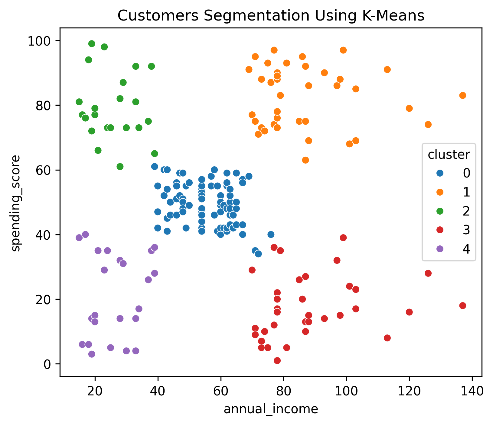

# 🛍️ Customer Segmentation Using K-Means Clustering

## 📌 Project Overview

Project ini bertujuan untuk melakukan **segmentasi customer** menggunakan metode **unsupervised learning (K-Means Clustering)**. Dengan segmentasi ini, bisnis dapat memahami pola perilaku pelanggan dan menyusun strategi pemasaran yang lebih **tepat sasaran dan efektif**.

Project ini merupakan **Project #4** dalam perjalanan belajar Machine Learning dan berfokus pada kemampuan:

* Exploratory Data Analysis (EDA)
* Feature Scaling
* Clustering
* Business Insight & Storytelling

---

## 📊 Dataset

* **Dataset**: Mall Customers Segmentation Dataset
* **Source**: Dataset publik
* **Jumlah Data**: 200 customer
* **Fitur Utama**:

  * `Age`
  * `Annual Income (k$)`
  * `Spending Score (1–100)`

Dataset ini merepresentasikan perilaku customer di sebuah mall berdasarkan pendapatan dan kebiasaan belanja.

---

## 🔍 Exploratory Data Analysis (EDA)

Tahap EDA dilakukan untuk memahami karakteristik data sebelum proses clustering.

Beberapa analisis yang dilakukan:

* Distribusi usia customer
* Distribusi pendapatan tahunan
* Distribusi spending score
* Scatter plot antara annual income dan spending score

Hasil EDA menunjukkan bahwa customer memiliki pola belanja yang beragam dan terdapat indikasi **kelompok alami** berdasarkan income dan spending.

---

## ⚙️ Data Preprocessing

Sebelum melakukan clustering, dilakukan preprocessing sebagai berikut:

* Pemilihan fitur utama (`annual_income` dan `spending_score`)
* Feature scaling menggunakan **StandardScaler**

Scaling sangat penting karena algoritma K-Means sensitif terhadap perbedaan skala fitur.

---

## 🤖 Modeling: K-Means Clustering

### Penentuan Jumlah Cluster

Jumlah cluster optimal ditentukan menggunakan **Elbow Method**.

Berdasarkan grafik Elbow, penurunan inertia terlihat signifikan hingga **k = 5**, kemudian mulai melandai. Oleh karena itu, dipilih **5 cluster** sebagai jumlah cluster optimal.

### Training Model

Model K-Means dilatih menggunakan:

* `n_clusters = 5`
* Fitur yang telah di-scale

Hasil clustering divisualisasikan dalam bentuk scatter plot untuk memudahkan interpretasi.

---

## 📈 Results & Cluster Interpretation

### Customers Segmentation

Hasil clustering membagi customer ke dalam **5 segmen utama**:

### 🟠 High Income – High Spending

Customer bernilai tinggi dengan daya beli dan aktivitas belanja yang tinggi.
**Rekomendasi**: Program loyalitas dan penawaran eksklusif.

### 🔴 High Income – Low Spending

Customer dengan potensi besar namun belum aktif berbelanja.
**Rekomendasi**: Promo personal dan campaign engagement.

### 🟢 Low Income – High Spending

Customer impulsif dan responsif terhadap promo.
**Rekomendasi**: Promo terbatas dan produk bernilai rendah.

### 🔵 Middle Segment

Customer dengan pendapatan dan perilaku belanja moderat.
**Rekomendasi**: Campaign reguler.

### 🟣 Low Income – Low Spending

Customer dengan kontribusi rendah.
**Rekomendasi**: Pendekatan mass campaign dengan effort minimal.

---

## 💡 Business Insights

Customer segmentation membantu bisnis:

* Memahami perilaku customer secara lebih mendalam
* Menentukan target campaign yang lebih tepat
* Mengoptimalkan alokasi budget pemasaran

Dengan pendekatan data-driven, keputusan bisnis dapat dibuat lebih efektif dibandingkan pendekatan umum.

---

## 🏁 Conclusion

Project ini menunjukkan bahwa metode **K-Means Clustering** mampu mengelompokkan customer ke dalam segmen yang bermakna. Hasil segmentasi dapat digunakan sebagai dasar strategi pemasaran dan pengambilan keputusan bisnis.

Project ini juga menjadi latihan penting dalam menghubungkan **data analysis, machine learning, dan business insight**.

---

## 🛠️ Tools & Libraries

* Python
* Pandas
* NumPy
* Matplotlib & Seaborn
* Scikit-learn

---

 *Project ini dibuat sebagai bagian dari pembelajaran Machine Learning dan Data Analysis.*
